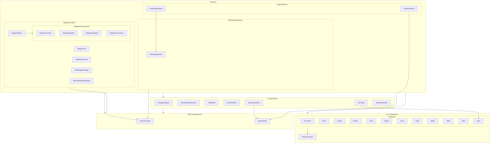

# Component Diagram Documentation

## Overview
This diagram represents the component architecture of our Mermaid Pro application. It is organized into several main layers:

1. **UI Components Layer**
   - Contains shared UI components that are reusable across the application
   - Centered around ThemeProvider for consistent styling

2. **Feature Components Layer**
   - Diagram Feature: Main functionality for creating and managing diagrams
   - Project Feature: Project management components
   - Workspace Feature: Workspace-related components

3. **State Management Layer**
   - ProjectContext: Application-wide project context
   - ProjectStore: Central state management

4. **Custom Hooks Layer**
   - Collection of custom hooks for various functionalities
   - Includes utilities for dispatch, keyboard shortcuts, responsive design, etc.

## Key Relationships

1. **Feature Dependencies**
   - All features depend on UI Components for basic interface elements
   - Features utilize State Management for data handling
   - Features leverage Custom Hooks for functionality

2. **Component Hierarchy**
   - DiagramEditor manages DiagramComponents
   - ProjectWorkspace integrates with WorkspacePanel
   - All UI components are themed through ThemeProvider

3. **State Management Flow**
   - Components connect to ProjectContext and ProjectStore as needed
   - Custom hooks provide interface to state management
   - Toast notifications managed through dedicated hook and component

## Design Patterns
- Compositional structure with clear separation of concerns
- Shared UI component library for consistency
- Context-based state management
- Custom hooks for reusable logic
