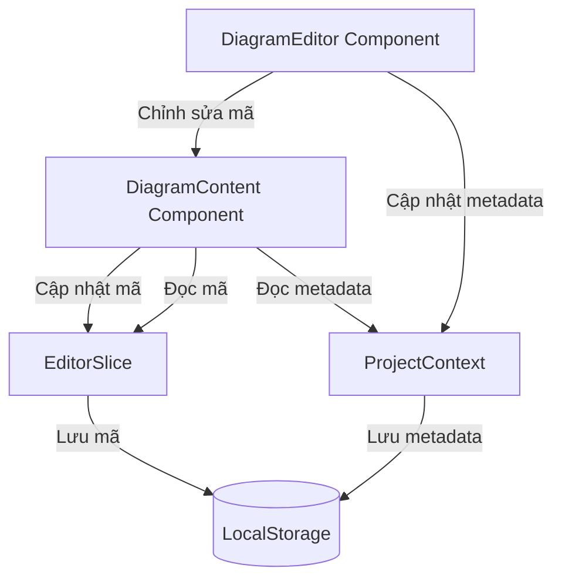

## Phân tích các thay đổi đã thực hiện

### 1. Phân tách trách nhiệm
- ✅ EditorSlice: Quản lý mã sơ đồ và trạng thái
- ✅ ProjectContext: Quản lý metadata (tên, ID, timestamps)

### 2. Các thay đổi chính đã thực hiện
1. ProjectContext:
   - ✅ Loại bỏ quản lý mã sơ đồ
   - ✅ Chỉ lưu trữ metadata trong localStorage
   - ✅ Cập nhật interface DiagramMetadata

2. EditorSlice:
   - ✅ Thêm quản lý trạng thái diagram
   - ✅ Lưu trữ mã sơ đồ trong localStorage
   - ✅ Thêm action importDiagrams

3. Components:
   - ✅ DiagramEditor: Sử dụng EditorSlice cho mã
   - ✅ DiagramContent: Đã tách biệt đúng
   - ✅ DiagramList: Cập nhật để sử dụng DiagramMetadata

### 3. Các điểm cần kiểm tra
1. Đồng bộ hóa:
   - LocalStorage cho mã sơ đồ
   - LocalStorage cho metadata
   - Trạng thái diagram trong EditorSlice

2. Type Safety:
   - Interface DiagramMetadata
   - Props của các components
   - Action payload trong EditorSlice
