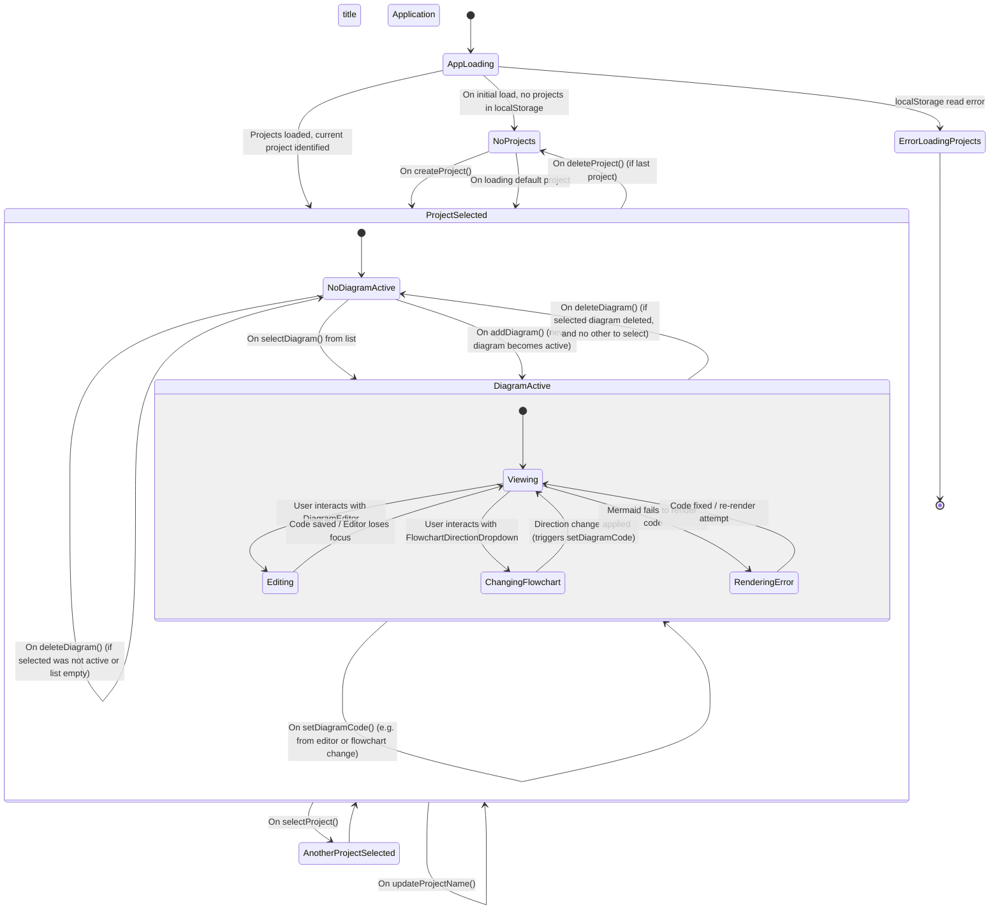

```mermaid
stateDiagram-v2
  title Application State Diagram (Project & Diagram Focus)

  [*] --> AppLoading

  AppLoading --> NoProjects: On initial load, no projects in localStorage
  AppLoading --> ProjectSelected: Projects loaded, current project identified
  AppLoading --> ErrorLoadingProjects: localStorage read error

  NoProjects --> ProjectSelected: On createProject()
  NoProjects --> ProjectSelected: On loading default project

  ProjectSelected --> ProjectSelected: On updateProjectName()
  ProjectSelected --> NoProjects: On deleteProject() (if last project)
  ProjectSelected --> AnotherProjectSelected: On selectProject()
  AnotherProjectSelected --> ProjectSelected

  state ProjectSelected {
    [*] --> NoDiagramActive
    NoDiagramActive --> DiagramActive: On selectDiagram() from list
    NoDiagramActive --> DiagramActive: On addDiagram() (new diagram becomes active)
    NoDiagramActive --> NoDiagramActive: On deleteDiagram() (if selected was not active or list empty)

    DiagramActive --> NoDiagramActive: On deleteDiagram() (if selected diagram deleted, and no other to select)
    DiagramActive --> DiagramActive: On updateDiagram() (e.g., name change)
    DiagramActive --> DiagramActive: On setDiagramCode() (e.g. from editor or flowchart change)

    state DiagramActive {
      [*] --> Viewing
      Viewing --> Editing: User interacts with DiagramEditor
      Editing --> Viewing: Code saved / Editor loses focus
      Viewing --> ChangingFlowchart: User interacts with FlowchartDirectionDropdown
      ChangingFlowchart --> Viewing: Direction change applied (triggers setDiagramCode)
      Viewing --> RenderingError: Mermaid fails to render code
      RenderingError --> Viewing: Code fixed / re-render attempt
    }
  }

  ErrorLoadingProjects --> [*]
```
