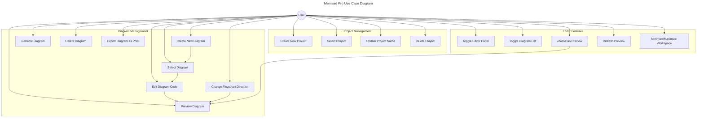

## Use Case Descriptions

### Project Management
1. **Create New Project**
   - Actor: User
   - Description: Tạo một dự án mới với tên do người dùng chọn
   - Precondition: Người dùng đã mở ứng dụng
   - Basic Flow:
     1. Người dùng chọn "Add" từ Project Selector
     2. Nhập tên dự án
     3. Hệ thống tạo dự án mới với ID duy nhất
     4. Dự án mới được lưu vào localStorage
     5. UI được cập nhật để hiển thị dự án mới

2. **Select Project**
   - Actor: User
   - Description: Chuyển đổi giữa các dự án hiện có
   - Basic Flow:
     1. Người dùng chọn dự án từ danh sách
     2. Hệ thống tải dữ liệu dự án
     3. UI được cập nhật với nội dung dự án được chọn

### Diagram Management
1. **Create New Diagram**
   - Actor: User
   - Description: Tạo một sơ đồ mới trong dự án hiện tại
   - Precondition: Đã chọn một dự án
   - Basic Flow:
     1. Người dùng chọn "Add Diagram"
     2. Nhập tên sơ đồ
     3. Hệ thống tạo sơ đồ mới với mã mermaid mặc định
     4. Sơ đồ mới được thêm vào dự án
     5. Editor hiển thị sơ đồ mới để chỉnh sửa

2. **Edit Diagram Code**
   - Actor: User
   - Description: Chỉnh sửa mã Mermaid của sơ đồ
   - Precondition: Đã chọn một sơ đồ
   - Basic Flow:
     1. Người dùng chỉnh sửa mã trong Editor
     2. Hệ thống tự động lưu thay đổi
     3. Preview được cập nhật real-time
     4. Dữ liệu được lưu vào localStorage

### Editor Features
1. **Zoom/Pan Preview**
   - Actor: User
   - Description: Điều chỉnh view của preview sơ đồ
   - Basic Flow:
     1. Người dùng có thể zoom in/out bằng nút hoặc scroll
     2. Người dùng có thể pan bằng cách kéo preview
     3. Hệ thống lưu trạng thái zoom/pan cho mỗi sơ đồ

2. **Change Flowchart Direction**
   - Actor: User
   - Description: Thay đổi hướng của flowchart (TD/BT/LR/RL)
   - Precondition: Sơ đồ hiện tại là một flowchart
   - Basic Flow:
     1. Người dùng chọn hướng mới từ dropdown
     2. Hệ thống cập nhật mã sơ đồ
     3. Preview được cập nhật với hướng mới
